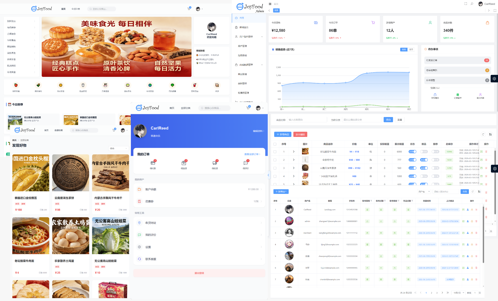

<div align="center">
  
</div>

# JoyFood 食品商城管理系统前端 (JoyFood Mall Frontend)

<p align="center">
  
  
  
  
  
  
</p>

<p align="center">
  <b>基于 Vue 3 + TypeScript + Vite 的现代化食品商城管理系统前端</b>
</p>

---

## 📖 项目简介

JoyFood 食品商城管理系统前端是配套后端服务的现代化 Web 应用，采用 **Vue 3 组合式 API** 与 **TypeScript** 开发，基于 **Vite** 构建工具实现极速开发与热更新。系统面向消费者提供流畅的购物体验以及面向管理者提供数据化经营后台，涵盖商品浏览、购物车、订单管理、可视化仪表盘等完整功能模块。

> [!TIP]
> 商城登录页做了个小暗门，可以快捷跳转至管理后台登录页哦（连续点击5次中间灰色字）

**项目预览图**


---

## ✨ 核心特性

- **⚡ 极速开发体验**：基于 Vite 的毫秒级热更新（HMR）与极速冷启动
- **🔧 组合式 API**：Vue 3 `<script setup>` 语法，逻辑复用更优雅
- **🎨 企业级 UI 组件**：Element Plus 组件库，覆盖表格、表单、对话框等 40+ 组件
- **📊 数据可视化**：ECharts 动态图表，支持销售趋势、品类占比等经营数据展示
- **🌓 主题自适应**：明亮/暗黑模式无缝切换，ECharts 图表主题动态适配
- **📱 响应式布局**：适配 PC、移动端多终端显示
- **🛒 完整交易流程**：商品浏览 → 购物车 → 结算 → 支付 → 订单追踪全链路

---

## 🛠️ 技术栈

| 类别 | 技术 | 版本 |
|:---|:---|:---|
| 前端框架 | Vue.js | 3.5.17 |
| 语言 | TypeScript | 5.x |
| 构建工具 | Vite | 5.x |
| UI 组件库 | Element Plus | 2.x |
| 状态管理 | Pinia | 2.x |
| 路由管理 | Vue Router | 4.x |
| 数据可视化 | Apache ECharts | 5.x |
| HTTP 客户端 | Axios | 1.x |
| 样式方案 | SCSS + UnoCSS | - |
| 包管理器 | pnpm | 8.x |
| 代码规范 | ESLint | - |

---

## 🚀 快速开始

### 环境要求

- Node.js 18+
- pnpm 8.x（推荐使用 pnpm，支持 workspace 与高效磁盘利用）

### 1. 克隆项目

```bash
git clone git clone https://github.com/Carl-Reed/JoyFoodMall-Vue3.git
cd joyfood-mall
```

### 2. 安装依赖

```bash
pnpm install
```

### 3. 配置环境变量

项目已预设开发环境配置，如需修改后端 API 地址，编辑 `.env.development`

项目采用反向代理，已将`/api`开头的地址指向`localhost:8080`。根据自身若需更改，编辑`vite.config.ts`的`proxy`部分

### 4. 启动开发服务器

```bash
pnpm run dev
```

服务启动后，访问地址：**`http://localhost:3333`**
（如需结束服务，在终端处Ctrl+C即可触发结束服务命令）

### 5. 构建生产版本

```bash
# 生产环境构建
pnpm run build

# 预览生产构建
pnpm run preview
```

---

## 📜 可用脚本

| 命令 | 说明 |
|:---|:---|
| `pnpm run dev` | 启动开发服务器（端口 3333，热更新） |
| `pnpm run build` | 生产环境构建（输出至 `dist/`） |
| `pnpm run preview` | 本地预览生产构建 |
| `pnpm run lint` | 运行 ESLint 代码检查 |
| `pnpm run lint:fix` | 自动修复 ESLint 可修复的问题 |
| `pnpm run type-check` | 运行 TypeScript 类型检查 |

---

## 🔗 后端项目

本项目为前端应用，配套后端服务请访问：

👉 [JoyFood-Mall-SpringBoot](https://github.com/Carl-Reed/JoyFood-Mall-SpringBoot) （Spring Boot + MyBatis-Plus + Spring Security + JWT）

---

## 📁 项目结构

```
joyfood-mall-frontend/
├── public/                          # 静态资源（不经过构建处理）
├── src/
│   ├── common/                      # 通用工具、常量、枚举
│   ├── http/                        # Axios 封装、请求拦截器、API 接口定义
│   ├── layouts/                     # 布局组件（后台布局、前台布局）
│   ├── pages/                       # 页面组件
│   │   ├── admin/                   # 后台管理页面
│   │   │   ├── dashboard/         # 可视化仪表盘
│   │   │   ├── user/              # 用户管理
│   │   │   ├── role/              # 角色管理
│   │   │   ├── product/           # 商品管理
│   │   │   ├── category/          # 分类管理
│   │   │   ├── banner/            # 轮播图管理
│   │   │   ├── order/             # 订单管理
│   │   │   ├── cart/              # 购物车管理
│   │   │   └── file/              # 文件上传记录管理
│   │   └── mall/                    # 前台商城页面
│   │       ├── home/              # 首页
│   │       ├── product/           # 商品详情
│   │       ├── cart/              # 购物车
│   │       ├── checkout/          # 结算页
│   │       ├── order/             # 个人订单
│   │       ├── profile/           # 个人中心
│   │       └── address/           # 收货地址管理
│   ├── pinia/                       # Pinia Store（用户、购物车、主题等状态）
│   ├── plugins/                     # 插件配置（Element Plus、ECharts 等）
│   ├── router/                      # Vue Router 路由配置
│   ├── App.vue                      # 根组件
│   └── main.ts                      # 应用入口
├── types/                           # TypeScript 类型声明
│   ├── auto/                        # 自动生成的类型（如组件库类型）
│   ├── api.d.ts                     # API 接口类型
│   ├── directives.d.ts              # 自定义指令类型
│   ├── env.d.ts                     # 环境变量类型
│   └── vue-router.d.ts              # 路由元信息类型扩展
├── tests/                           # 测试文件
│   └── utils/                       # 工具函数测试
├── .env                             # 通用环境变量
├── .env.development                 # 开发环境配置
├── .env.staging                     # 预发布环境配置
├── .env.production                  # 生产环境配置
├── vite.config.ts                   # Vite 构建配置
├── tsconfig.json                    # TypeScript 配置
├── uno.config.ts                    # UnoCSS 原子化 CSS 配置
├── eslint.config.js                 # ESLint 代码规范配置
├── package.json                     # 项目依赖与脚本
├── pnpm-workspace.yaml              # pnpm 工作区配置
├── pnpm-lock.yaml                   # pnpm 锁定文件
├── index.html                       # HTML 入口模板
├── .editorconfig                    # 编辑器统一配置
├── .gitignore                       # Git 忽略规则
├── .npmrc                           # npm/pnpm 配置
└── LICENSE                          # 开源许可证
```

### 目录设计说明

```
┌─────────────────────────────────────────────────────────────┐
│  src/pages/        │ 按业务模块组织页面，admin 与 mall 分离   │
├─────────────────────────────────────────────────────────────┤
│  src/http/         │ Axios 实例封装 + API 接口统一管理        │
├─────────────────────────────────────────────────────────────┤
│  src/pinia/        │ 全局状态：用户信息、购物车数据、主题模式   │
├─────────────────────────────────────────────────────────────┤
│  src/router/       │ 路由配置，含权限守卫与动态路由加载        │
├─────────────────────────────────────────────────────────────┤
│  src/layouts/      │ 后台侧边栏布局 + 前台商城布局            │
├─────────────────────────────────────────────────────────────┤
│  types/            │ 全局类型声明，增强 TypeScript 类型推断   │
└─────────────────────────────────────────────────────────────┘
```

## 🎨 功能模块

### 后台管理子系统 (Admin)

| 模块 | 功能描述 |
|:---|:---|
| **可视化仪表盘** | 销售趋势折线图、品类占比饼图、热销 Top10、核心指标卡片 |
| **用户管理** | 用户列表、信息编辑、头像上传、角色分配、状态控制、密码重置 |
| **角色管理** | 角色列表、创建编辑、权限分配、关联用户校验 |
| **商品管理** | 商品列表、步骤式发布/编辑（基础信息 → SKU 规格 → 详情描述）、上下架、库存调整 |
| **分类管理** | 多级树形分类、排序控制、启用状态、关联商品校验 |
| **轮播图管理** | Banner 列表、图片上传、跳转链接、排序与显示状态控制 |
| **订单管理** | 订单列表、状态筛选、详情查看、发货处理、物流信息录入 |
| **购物车管理** | 用户购物车数据查看、单项移除、一键清空 |
| **文件记录管理** | 上传文件列表、使用状态追踪、过期未使用文件清理 |

### 前台商城子系统 (Mall)

| 模块 | 功能描述 |
|:---|:---|
| **首页** | 轮播图、分类快捷入口、今日推荐、新品首发、猜你喜欢 |
| **商品浏览** | 分类筛选、关键词搜索、商品列表、瀑布流布局、图片懒加载 |
| **商品详情** | 主图轮播、SKU 规格选择、库存状态、富文本详情、加入购物车/立即购买 |
| **购物车** | 商品列表、数量调整、选中结算、失效商品标记、实时金额计算 |
| **结算页** | 收货地址选择、商品清单、运费计算（满额免邮）、订单备注、提交订单 |
| **个人订单** | 状态标签页（全部/待付款/待发货/待收货/已完成/已关闭）、支付/取消/确认收货/删除 |
| **个人中心** | 用户信息概览、订单状态快捷入口、资产与工具菜单 |
| **资料设置** | 头像上传、基础信息修改、密码修改 |
| **地址管理** | 多地址列表、省市区三级联动、默认地址设置、新增/编辑/删除 |

---

## 🔌 前后端交互

### 架构交互图

```
┌──────────────┐      RESTful API       ┌─────────────────┐
│  前端 Vue 3  │  ◀──────────────────▶ │ 后端 Spring Boot│
│              │    Axios + JSON        │                 │
│  ┌────────┐  │                        │  ┌────────────┐ │
│  │ Element│  │                        │  │ Controller │ │
│  │  Plus  │  │                        │  ├────────────┤ │
│  ├────────┤  │                        │  │  Service   │ │
│  │  Pinia │  │                        │  ├────────────┤ │
│  ├────────┤  │                        │  │   Mapper   │ │
│  │ ECharts│  │                        │  ├────────────┤ │
│  ├────────┤  │                        │  │   MySQL    │ │
│  │ Vue    │  │                        │  └────────────┘ │
│  │ Router │  │                        └─────────────────┘
│  └────────┘  │
└──────────────┘
```

### 请求流程

```
用户操作 ──▶ 前端校验 ──▶ Axios 请求 ──▶ JWT Token 注入请求头
                                              │
                                              ▼
                                        后端 Spring Security 拦截
                                              │
                                              ▼
                                        Controller → Service → Mapper → MySQL
                                              │
                                              ▼
                                        JSON 响应 ──▶ 前端状态更新 ──▶ UI 渲染
```

---

## 🌓 主题系统

系统支持明亮/暗黑模式无缝切换，核心实现：

- **Element Plus**：通过 CSS 变量实现组件主题切换
- **ECharts 适配**：监听主题状态变化，动态获取 CSS 变量更新图表配色
- **Pinia 持久化**：用户主题偏好存储至 LocalStorage，刷新后保持

---

## 🧩 关键组件

### 通用组件封装

| 组件 | 用途 |
|:---|:---|
| `ImageUploader` | 异步图片上传（支持拖拽、预览、格式校验） |
| `RichTextEditor` | 富文本编辑器（商品详情、集成图片上传） |
| `CategoryTree` | 多级分类树形选择器 |
| `AddressPicker` | 省市区三级联动选择 |
| `StatusTag` | 状态标签（订单状态、商品状态等） |
| `DataTable` | 封装 Vxe Table / Element Plus Table，支持分页、排序、筛选 |

---

## 📱 响应式适配

| 终端 | 分辨率范围 | 适配策略 |
|:---|:---|:---|
| PC 端 | ≥ 1366px | 完整功能，侧边栏导航 |
| 移动端 | < 768px | 简化交互，底部导航，核心功能可用 |

---

## 🤝 贡献指南

1. Fork 本仓库
2. 创建特性分支：`git checkout -b feature/xxx`
3. 提交更改：`git commit -m 'feat: add some feature'`
4. 推送分支：`git push origin feature/xxx`
5. 创建 Pull Request

欢迎提交 Issue 或 Pull Request 共同完善项目！

---

## 📄 许可证

本项目基于 [MIT License](https://github.com/Carl-Reed/JoyFoodMall-Vue3/blob/main/LICENSE) 开源。

<p align="center">
  <sub>Built with ❤️ by CarlReed | © 2026 JoyFood Mall</sub>
</p>
